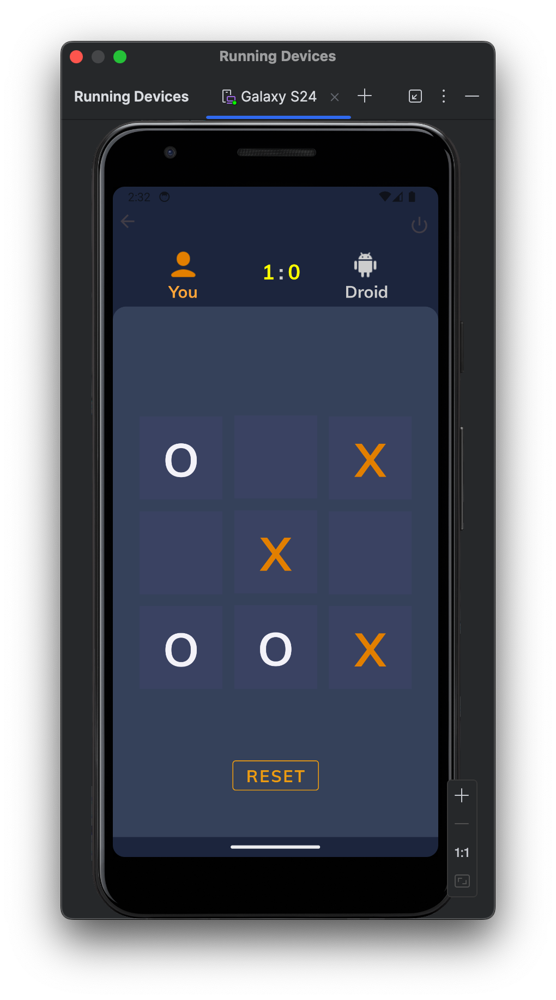
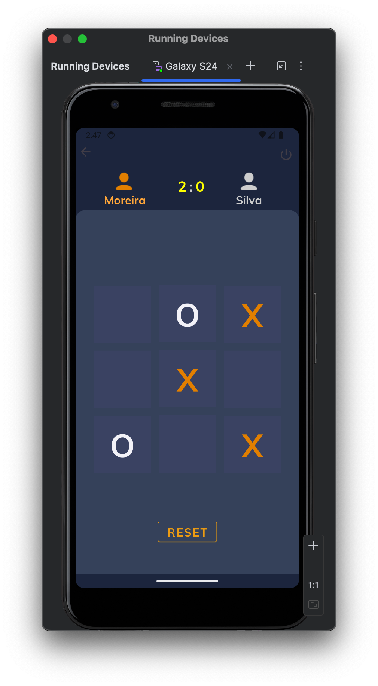

<h1 align="center">Tic-Tac-Toe Game ❌⭕ </h1>

## Project 🎯 

Exercise 05 - Mobile Device Programming: "Tic-Tac-Toe Game UI" is a user-friendly Android app for simulating the classic Tic-Tac-Toe game with real-time gameplay, turn-based logic, and an intuitive design.
 

## Layout 🎨 

<div align="center">
  <table style="border-collapse: collapse; margin: 10px;">
    <tr>
      <td style="padding: 10px; text-align: center;">
        
      </td>
      <td style="padding: 10px; text-align: center;">
        
      </td>
    </tr>
  </table>
</div>

## Technologies Used 🤖🍏

- **Programming Language:** Kotlin
- **Development Environment:** Android Studio

## Code Author 💻👨‍💻

```kotlin
fun main() {
    println("Code by Júnio Moreira!")
    println("Welcome to the UpDown Control!")
}
